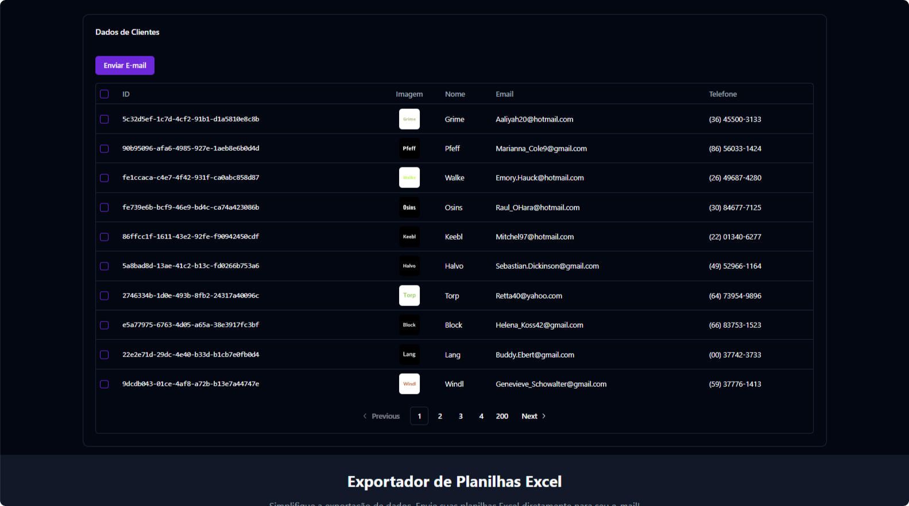

<h1 align="center">

Teste para Desenvolvedor Trainee</h1>

    
    
    
    

## :page_with_curl: Descrição

O projeto "QuickExcel" é uma aplicação web fullstack que automatiza o processo de envio de planilhas Excel por e-mail. Com uma interface amigável, os usuários podem fazer upload de suas planilhas com base de dados de clientes, facilitando a distribuição de dados essenciais de forma prática e rápida. O backend, desenvolvido em C# com ASP.NET Core, é responsável por processar os arquivos, enquanto o frontend em React oferece uma experiência interativa e intuitiva. Este projeto visa otimizar a comunicação e a troca de informações, tornando o envio de relatórios e análises uma tarefa simples e eficiente.

## :dart: Desafios

- [x] Autenticação com JWT
- [x] Front-end em React
- [x] API em ASP.NET Core
- [x] Conteinerização de Deploy com Docker

## :pushpin: Requisitos

- [Visual Studio Code](https://visualstudio.microsoft.com/vs/)
- [Node.js](https://nodejs.org/en)

## :computer: Acesse em produção

> https://teste-atak.vercel.app/

#### Frontend

  
  
  
  
  
  
  
  

#### Backend

       

## :bookmark_tabs: Licença

Este projeto está sob licença MIT. Consulte `LICENSE` para mais informações.

## :adult: Autores

<!-- ALL-CONTRIBUTORS-LIST:START - Do not remove or modify this section -->
<!-- prettier-ignore-start -->
<!-- markdownlint-disable -->
<table>
  <tbody>
    <tr>
      <td align="center" valign="top" width="14.28%"><a href="https://gustavohenrique.vercel.app/"> <b>Gustavo Henrique</b></a> <a href="#code-Gustavohps10" title="Code">💻</a></td>
    </tr>
  </tbody>
</table>

<!-- markdownlint-restore -->
<!-- prettier-ignore-end -->

<!-- ALL-CONTRIBUTORS-LIST:END -->
